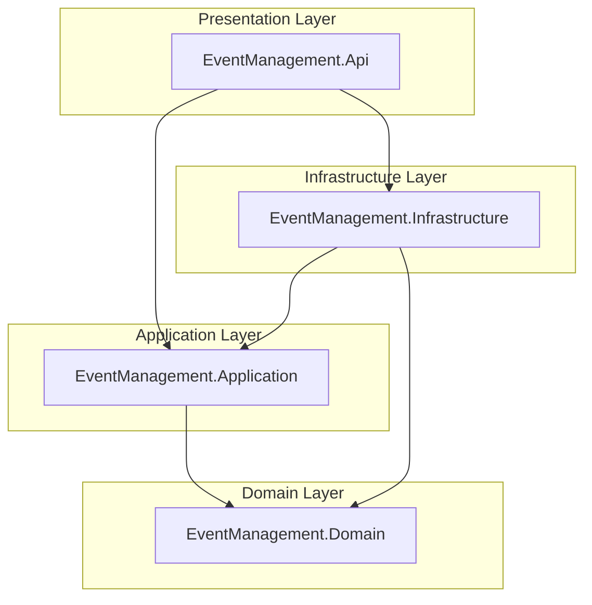

# EventManagement — Clean Architecture Layers

```mermaid
flowchart TB
    subgraph PRES["Presentation Layer"]
      API["EventManagement.Api"]
    end
    subgraph INFRA_L["Infrastructure Layer"]
      INFRA["EventManagement.Infrastructure"]
    end
    subgraph APP_L["Application Layer"]
      APP["EventManagement.Application"]
    end
    subgraph DOM_L["Domain Layer"]
      DOMAIN["EventManagement.Domain"]
    end

    API --> APP
    API --> INFRA
    INFRA --> APP
    INFRA --> DOMAIN
    APP --> DOMAIN
```
